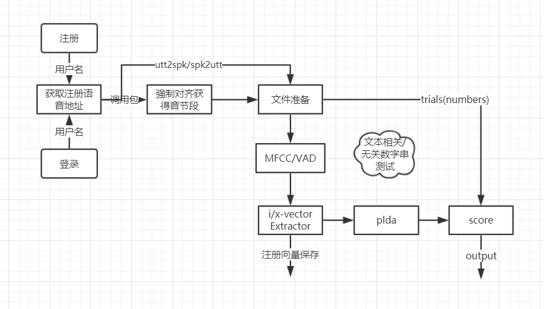

### ivector/xvector-plda

```
.
|-- audios //语音文件
|   |-- text
|   `-- wav
|-- forced_align //辅助工具
|   `-- matreal
|       `-- files
|-- userdata //用户数据
|   |-- user1
|   |   |-- model
|   |   |   `-- enroll_xvector
|   |   `-- temp
|   |       |-- test_xvector
|   |       |-- textgrid
|   |       |-- trials
|   |       `-- utt2spk
|   `-- user2
|-- xvector //kaldi调用文件(已经移到当前文件)
|   `-- files
|-- README.md
|-- construc.md
|-- construct.md
`-- prepare.py
```

<center>
    
</center>

### Result
login 21p \*3utts  
test 63p \*10utts  
eer 2.59%   
threshold 34  

### enroll and login
enroll takes:  
user    0m2.072s  
sys     0m0.551s  

login takes:  
user    0m1.232s  
sys     0m0.600s  
