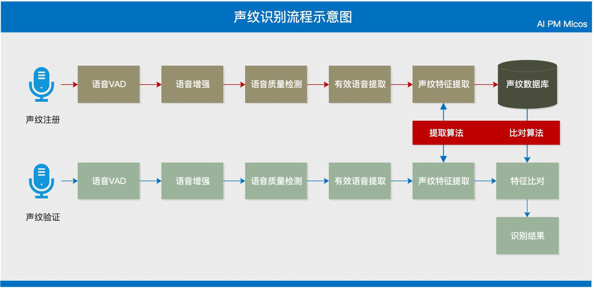
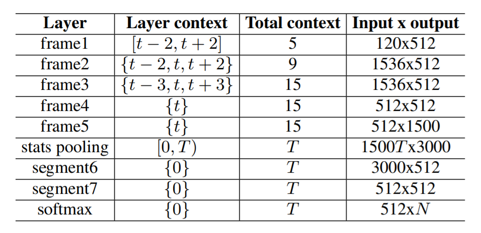
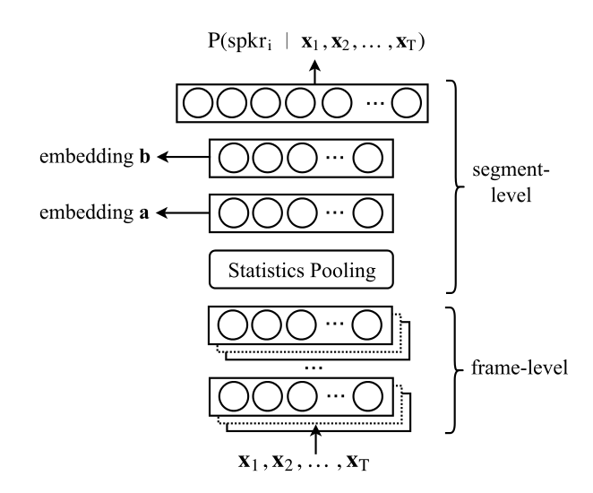
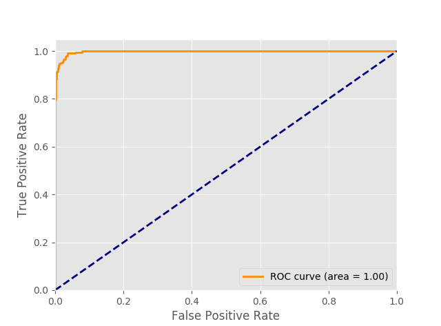
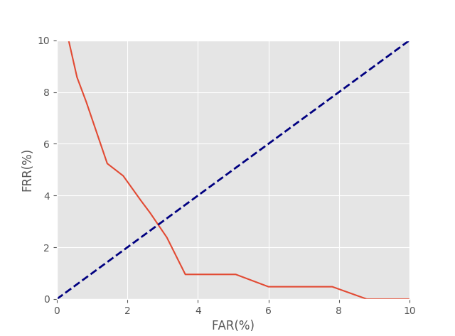

## 声纹识别
### 概述
基于X-vector模型的是声纹识别

### 设计与实现
声纹识别流程图

1. 准备语料训练集以及测试集，可以是不同语言越多越好
2. 使用mfcc提取特征，尝试过替换Mel-filter bank特征效果并不好，主要也没有调节各种参数
3. 利用回响和三种噪音增强了训练数据，测试了增强于非增强的效果还是非常明显
4. 这部分对增强的数据进行了随机筛选于原始数据相同数量级的数据提取特征并于原始数据结合
5. 做了归一化移除了静音帧
6. 这里移除了小于min_len时长的语音段，也舍弃了小于min_num_utts段数音频的说话人信息
7. 生成egs并训练xvector网络
8. 利用embedding层提取xvector特征
9. lda降维然后再用plda打分
10. 计算eer

#### X-Vector模型

- 结构

该系统由一个前馈DNN组成，它将可变长度的语音段映射到我们称之为x-vector的embedding。 一旦被提取，x-vector就由PLDA进行打分。

F代表特征纬度，L代表训练集中训练语言的数量，t代表语音帧。首先上下文5帧拼为一个帧集合，再以帧集合作为中心，拼接上下文4帧为一个新的帧集合，以此类推到拼接15帧为一个帧集合作为dnn的输入。统计信息的池化层在时间维度上聚合信息，以便后续层对整个音频段进行操作。 池化层的输入是来自前一层frame5的T 1500维向量的序列。 输出是输入的平均值和标准偏差（每个1500维向量）。 这些统计数据连接在一起（以生成3000维向量）并通过段级层，最后通过softmax输出层。 softmax层输出该段语音属于每个说话人的概率。

- 训练
    + 预处理
        * 在送到x-vector DNN之前，在3秒滑动窗口上对特征进行均值归一化，并且使用基于能量的语音检测系统来移除非语音帧。
    + 数据增强
        * 使用速度扰动，噪声添加，混响。
        * 1份原始数据+5份增广数据，增广数据由以下增广方案随机生成：
        * 速度扰动：0.9倍或1.1倍
        * 背景音乐添加：来自MUSAN，经过修剪或重复来匹配原始数据长度，信噪比5～15dB
        * 噪声添加：在整个原始音频中以1秒的间隔添加MUSAN噪声（0-15dB SNR）
        * 混响：来自RIR

- embedding
在非线性激活之前，在网络的segment6处提取512维x-vector（参见表1）。 由于池化层跨输入帧聚合，因此我们能够从每个语音段中提取单个x-vector。或者，x-vector DNN可用于直接对语言进行分类。  然而，我们发现提取embedding更灵活，因为它有助于集成为i-vector开发的后端技术。 此外，它允许扩展到新语言，而无需重新训练x-vector提取器。

#### plda分类
x-vector包含说话人和信道的信息, 可以使用lda/plda减弱信道的影响

$$X_{ij} = \mu + Fh_{i} + Gw_{ij} + \epsilon_{ij}$$
其中:  

- $\mu + Fh_{i}$ 信号部分, 描述说话人之间的差异(类间差异)
    + $\mu$ 全体训练数据的均值
    + F 身份空间, 包含用来表示各种说话人的信息
    + $h_{i}$ 具体的一个说话人的身份(说话人在身份空间中的位置)
- $Gw_{ij} + \epsilon_{ij}$ 噪音部分, 描述同一说话人的不同语音之间的差异(类内差异)
    + G 误差空间, 包含可以用来表示同一说话人不同语音变化的信息
    + $w_{ij}$ 表示说话人的某一条语音在G空间中的位置
    + $\epsilon_{ij}$ 最后的残留噪声项, 表示尚未解释的东西

用两个假象变量($\theta$, $\Sigma$)描述一个语音的数据结构:  
$$\theta = [\mu, F, G, \Sigma]$$

**plda模型训练**  
目标就是输入一堆数据$X_{ij}$(多个说话人多条语音), 使用EM迭代求解  

- 均值处理
    + 计算所有训练数据$X_{ij}$的均值$\mu$, 从训练数据中减去该均值$X_{ij} = X_{ij} - \mu$
    + 根据训练数据中的人数N, 计算N个人的均值$N_{\mu}$
- 初始化
    + 噪声空间G, 随机初始化
    + 身份空间F, 对每个人的均值数据$N_{\mu}$进行PCA降维, 赋值给F
    + 方差$\Sigma$初始化为常量
- EM迭代优化

使用PLDA打分之前，embedding被whitened，长度归一化，并且使用线性判别分析（LDA）降低维数。

#### 两阶段任务
1. 阶段一（对神经网络的训练）：

训练的神经网络结构如图所示，pooling层之前的结构是TDNN，TDNN总的输入是一段语音，每次TDNN取固定帧数，这个原理会在深度学习TDNN的介绍里详细说。然后pooling层把每个TDNN的输出向量积累下来后，计算均值和标准差作为pooling层的输出。pooling层之后接着两层全向连接层最后加一个softmax层为输出。输出的神经元个数和我们训练集中说话人个数保持一致。可以看到图中所写，输出是一个后验概率。这样设计的好处就是，我们可以处理时长不同的语音。
训练用损失函数为交叉熵：
$$
E = - \Sigma_{n=1}^{N}{\Sigma_{k=1}^{K}{d_{nk}\ln(P(spkr_k | x_{1:T}^{(n)}))}}
$$
其中 n代表要输入的语音（segment），k代表各个说话人， $P(spkr_k | x_{1:T}^{(n)})$是输入segment n后，由softmax层给出的它属于各个说话人的后验概率。$d_{nk}$只有当segment n 的标记（说话人）是k时才等于1，否则为0。观察公式，靠里的求和其实只有一项，靠外是对所有（或者是一个bash）内的语音的求和。
众所周知，神经网络并不仅仅是一个分类器，而是一个特征提取器和分类器的结合，每一层都有极强的特征提取能力。所以我们要高度利用神经网络的这种能力，因此我们把softmax层之前的两层用来作为这段语音的embeddings（可以理解为特征向量）。

2.  阶段二：
去掉已经训练好的神经网络的softmax层，之前已经说过，我们仅仅需要它的特征抽象能力。利用剩余结构为我们导出每段语音的embeddings。之后就是利用这些embeddings训练PLDA模型。和经典的PLDA/ivector相比较，提出的方法区别仅仅在于对语音特征向量提取的方法，提取出特征向量后（无论是ivector还是xvector）其余步骤都是一样的。

### 测试与分析

声纹确认识别系统的性能评价主要看两个参量，分别是错误接受率(False Acceptation Rate, FAR)和错误拒绝率(False Rejection Rate, FRR)。FAR是指将非目标说话人判别为目标说话人造成的错误。FRR是指将目标说话人误识成非目标说话人造成的错误。二者的定义如下：
$$错误接受率(FAR)=\frac{被接受的错误识别的语音样本数}{应被拒绝的语音样本数} \times 100\%
$$
$$
错误拒绝率(FRR)=\frac{被拒绝的正确识别的语音样本数}{应被接受的语音样本总数} \times 100\%
$$

在声纹识别系统中，可通过设定不同的阈值对FAR和FRR进行权衡。系统所要求的的安全性越高，则设定的阈值应越高，此时接受条件越严格，即FAR越低，但FRR越高；反之，如果系统追求较好的用户体验性(通过率高)，则阈值应越低，此时接受条件就越宽松，FAR就越高，但FRR就越低。一般采用检测错误权衡曲线(Detection Error Trade-ofs-Curve, DET)来反映两个错误率之间的关系：对一个特定的声纹识别系统，以FAR为横坐标轴，以FRR为纵坐标轴，通过调整其参数得到的FAR与FRR之间关系的曲线图，就是DET图。显然DET图离原点越近，系统性能越好。如图下所示，在测试集上的DET：

主要进行了含重放攻击和跨设备登录的声纹识别实验，未进行重放攻击检测时测试结果如下：

| 测试集   | 准确率 | EER  |
|-------|--------|------|
| 重放攻击 | 0.95   | 0.02 |
| 跨设备   | 0.91   | 0.09 |

>重放攻击包含8个说话人，共62条语音；每个说话人3条注册语音，其余为登录语音，包括重放攻击、他人等；  
>跨设备包括远场麦克风和近场Android和IOS设备，600个说话人，共4410条语音

其他情况分析

1. 说话人的不正常发音(感冒, 嘶哑, 假声)等对于识别有影响
2. 3条语音进行模型注册用时2.07s; 单条语音进行登录用时1.032s

### 创新性说明
- 声纹识别过程：X-Vector提取embedding -> LDA降维进行长度归一化 -> PLDA进行打分
    + 在实际应用中，往往被测试者或被验证者的语音长度相对较短，若使用传统的PLDA/ivector模型效果会相对一般。神经网络具有极强的特征提取能力，使用TDNN提取语音的embeddings，然后再基于一个PLDA backend 对embeddings进行相似度打分。
    + PLDA打分, 减弱跨信道影响
- 模型训练相关
    + 数据增强, 使得模型可以适应不同环境, 增强模型泛化能力
    + 可以跨语言识别

### 参考文献
- Robust DNN embeddings for speaker recognition
- Deep neural network embeddings for text-independent speaker verification
- X-VECTORS: ROBUST DNN EMBEDDINGS FOR SPEAKER RECOGNITION